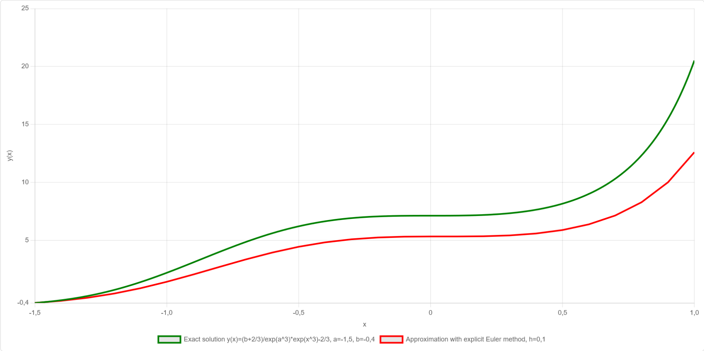

# Numerische Differentialgleichungslösung / Numerical differential equation solver

Numerical differential equation solver is a web service for calculating and showing soltions of ordinary differential equation (ODE) using numerical methods.

## Usage

To use numerical differential equation solver just go to

**[a-herzog.github.io/NumericalODE](https://a-herzog.github.io/NumericalODE)**

You can also download numerical differential equation solver as an offline usable application:

* **[NumericalODE.exe](https://github.com/A-Herzog/NumericalODE/releases/latest/download/NumericalODE.exe)**
* **[NumericalODE_Linux_MacOS.zip](https://github.com/A-Herzog/NumericalODE/releases/latest/download/NumericalODE_Linux_MacOS.zip)**

## License

Numerische Differentialgleichungslösung / Numerical differential equation solver is licensed under the [Apache License, Version 2.0](https://www.apache.org/licenses/LICENSE-2.0).

This product bundles some components licensed under different open source licenses, see:

- [**Bootstrap**](https://getbootstrap.com/): [MIT license](https://opensource.org/license/mit/)
- [**Bootstrap icons**](https://icons.getbootstrap.com): [MIT license](https://opensource.org/license/mit/)
- [**Chart.js**](https://www.chartjs.org): [MIT license](https://opensource.org/license/mit/)
- [**chartjs-plugin-zoom**](https://www.chartjs.org/chartjs-plugin-zoom/latest/): [MIT license](https://opensource.org/license/mit/)
- [**Math.JS**](https://mathjs.org/): [Apache 2.0](https://opensource.org/license/apache-2-0)

For building a desktop app from the Javascript code [**Neutralinojs**](https://neutralino.js.org/) under the
[MIT license](https://opensource.org/license/mit/) is used.

## Contact

[Alexander Herzog](https://github.com/A-Herzog)